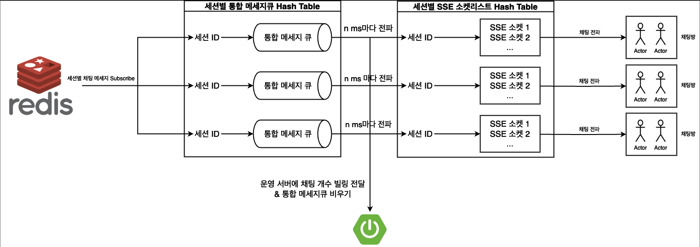

<div align=center>
		
</div>
<div align=center>
	<h3>📚 Tech Stack 📚</h3>
	<p>✨ Platforms & Languages ✨</p>
</div>
<div align="center">
	
	
	

</div>
<br>
<div align=center>
	<p>🛠 Tools 🛠</p>
</div>
<div align=center>
	
	
</div>
<br>

## 개요
실시간 라이브 스트리밍 SaaS 프로젝트 "Instream" 중 채팅 sync 서버 프로젝트입니다.
<br/>
<br/>

## 채팅 Sync 서버 아키텍쳐
<div align="center">
    
</div>

## 주요 기능
+ redis pub/sub를 사용한 채팅방 연결 및 관리 
+ sse를 사용하여 클라이언트로 채팅 메시지 전송
</br>

## 주요 특징
+ 클라이언트 측 UX를 고려한 대규모 데이터 렌더링 설계
  + 로컬 메모리에 채팅 저장 후 초당 일정 횟수로 사용자에게 채팅 제공
+ pub/sub을 통한 확장 가능한 구조
+ 같은 채팅그룹에 대한 sticky 설정 제공
<br/>

## SSE 채팅 전파 로직

<div align="center">
    
</div>

SSE를 통해 각 세션별 채팅 참가자에게 채팅을 전파하는 기능은 다음과 같이 구현했습니다.

+ 각 세션별 통합 메세지큐 관리
+ 각 세션별로 생성된 SSE 소켓 리스트 관리
+ n ms마다 각 세션별 통합 메세지큐에 담긴 메세지를, 각 세션별로 생성된 SSE 소켓 리스트에 똑같이 전파 - O(n) 소요
  + 통합 메세지큐에 담긴 메세지를 임시로 복사
  + SSE 소켓 리스트를 순회하면서, 임시 복사된 메세지 리스트를 deep copy하여 메세지 전파
  + 메세지 전파할 때 deep copy를 사용해 thread가 서로 침범하지 않는 환경이 보장되므로 parallelStream으로 병렬 처리하여 속도 향상
+ Multi-threading 환경을 대비하여 Concurrent 자료구조 사용
  + 채팅 전파 시점을 기준으로 Concurrent 자료구조에서 Capturing 된 메세지를 전파 
  + Redis에서 새로운 메세지를 통합 메세지큐에 추가하더라도, 해당 메세지는 다음 채팅 전파 스케쥴 때 사용
  + Capturing 된 메세지 개수를 바탕으로 사용량 측정

## 서버 실행

프로젝트 루트 경로에 .env 파일을 생성하고 다음과 같이 파일 내용을 작성합니다.
```dotenv
# .env
REDIS_IP=your_redis_ip
REDIS_PORT=your_redis_port
REDIS_PASSWORD=your_redis_password 
TENANT_BASE_URL=your_tenant_base_url
```

이후 터미널에서 다음 명령어를 실행합니다.
```shell
# shell
./gradlew clean  build -x test --refresh-dependencies
docker build --tag instream-chat-server .
docker-compose down
docker-compose up -d
```
