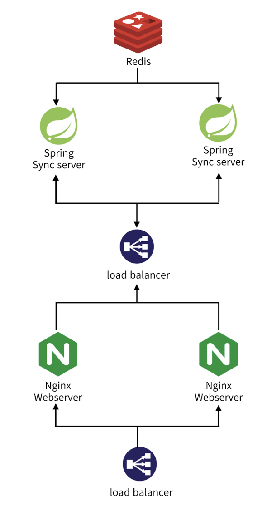

<div align=center>
		
</div>
<div align=center>
	<h3>📚 Tech Stack 📚</h3>
	<p>✨ Platforms & Languages ✨</p>
</div>
<div align="center">
	
	
	

</div>
<br>
<div align=center>
	<p>🛠 Tools 🛠</p>
</div>
<div align=center>
	
	
</div>
<br>

## 개요
4학년 2학기 SW캡스톤디자인 "실시간 라이브 스트리밍 SaaS" 프로젝트 중 채팅 sync 서버 프로젝트입니다.
<br/>
주요 기능은 다음과 같습니다.

## 채팅 Sync 서버 아키텍쳐
<div align="center">
    
</div>

## 주요 기능
+ redis pub/sub를 사용한 채팅방 연결 및 관리 
+ sse를 사용하여 클라이언트로 채팅 메시지 전송

## 서버 실행

프로젝트 루트 경로에 .env 파일을 생성하고 다음과 같이 파일 내용을 작성합니다.
```dotenv
# .env
REDIS_IP=your_redis_ip
REDIS_PORT=your_redis_port
REDIS_PASSWORD=your_redis_password 
TENANT_BASE_URL=your_tenant_base_url
```

이후 터미널에서 다음 명령어를 실행합니다.
```shell
# shell
./gradlew clean  build -x test --refresh-dependencies
docker build --tag instream-chat-server .
docker-compose down
docker-compose up -d
```
